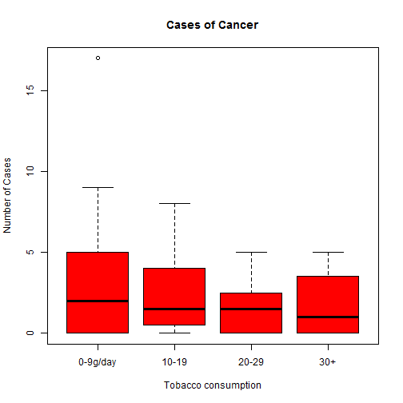

##   Esophageal cancer

Esophageal cancer is a disease in which malignant (cancer) cells form in the tissues of the esophagus. The esophagus is a muscular tube that moves food and liquids from the throat to the stomach.

The most common types of esophageal cancer are squamous cell carcinoma and adenocarcinoma. Squamous cell carcinoma begins in flat cells lining the esophagus. Adenocarcinoma begins in cells that make and release mucus and other fluids.

Smoking and heavy alcohol use increase the risk of esophageal squamous cell carcinoma. Gastroesophageal reflux disease and Barrett esophagus may increase the risk of esophageal adenocarcinoma.

Esophageal cancer is often diagnosed at an advanced stage because there are no early signs or symptoms.

You can get more information on:
http://www.cancer.gov/types/esophageal

---
## Dataset Documentation

Data used here is part of R datasets Package

# R Documentation


Smoking, Alcohol and (O)esophageal Cancer

Data from a case-control study of (o)esophageal cancer in Ille-et-Vilaine, France.

A data frame with records for 88 age/alcohol/tobacco combinations.

Author: Thomas Lumley

Source: Breslow, N. E. and Day, N. E. (1980) Statistical Methods in Cancer Research. Volume 1: The Analysis of Case-Control Studies. IARC Lyon / Oxford University Press.

---
## The App


In this application you can Visualize the effects of the three different variables on the number of cases of esophageal cancer.

next you can see an example...

---

```r
library(datasets)
Data <- esoph
boxplot(ncases ~ tobgp, data = Data, col = 2, main = "Cases of Cancer",
            xlab = "Tobacco consumption", ylab = "Number of Cases")
```


